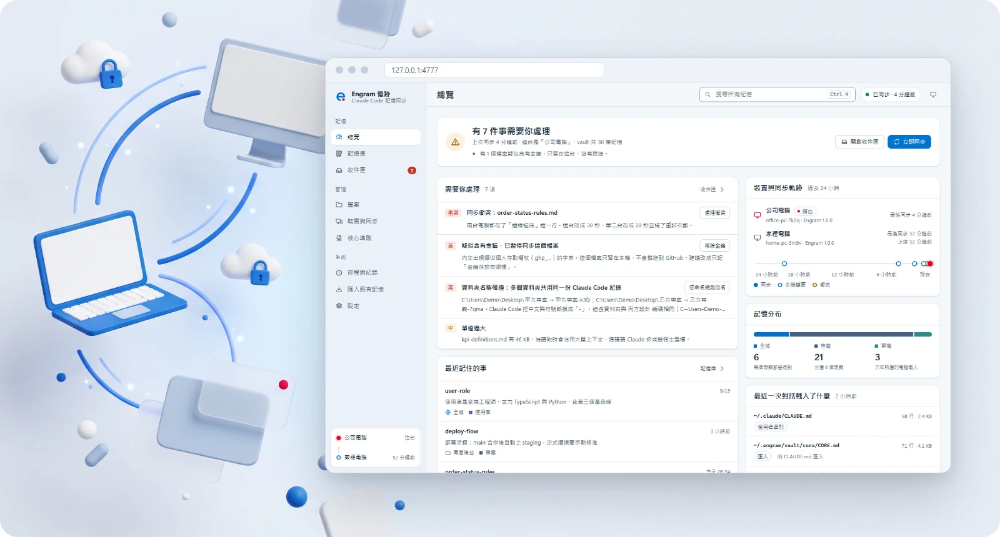
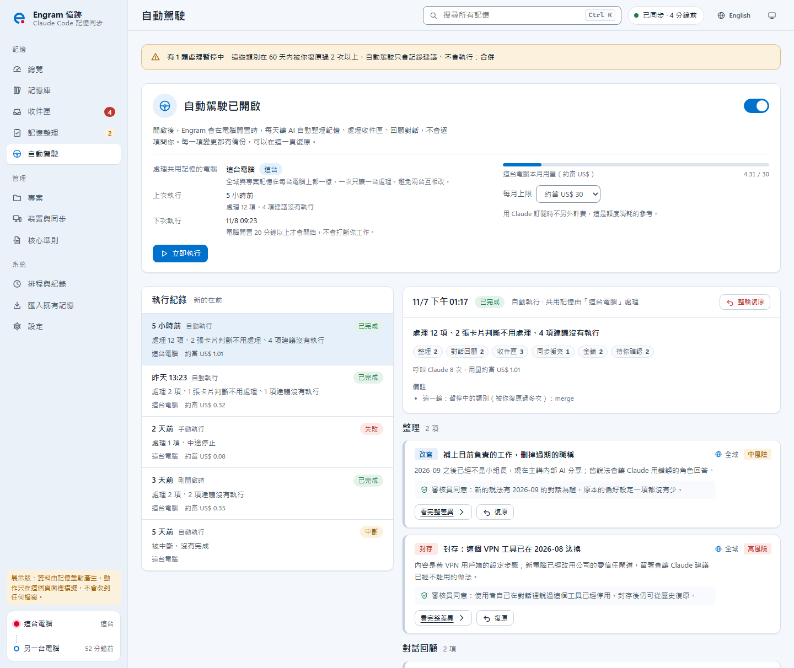
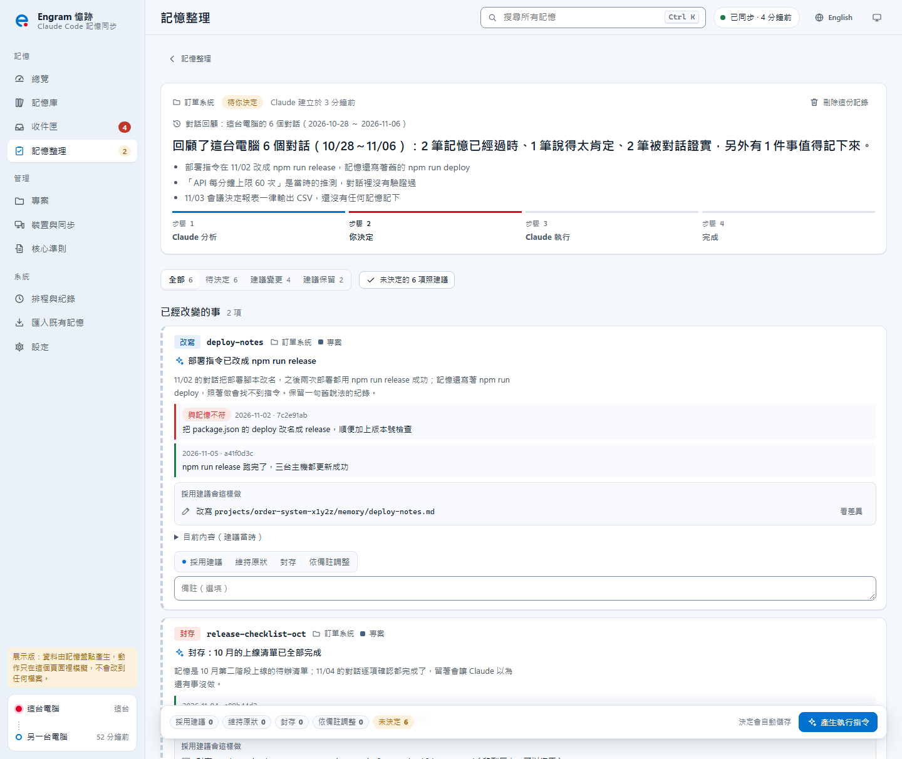
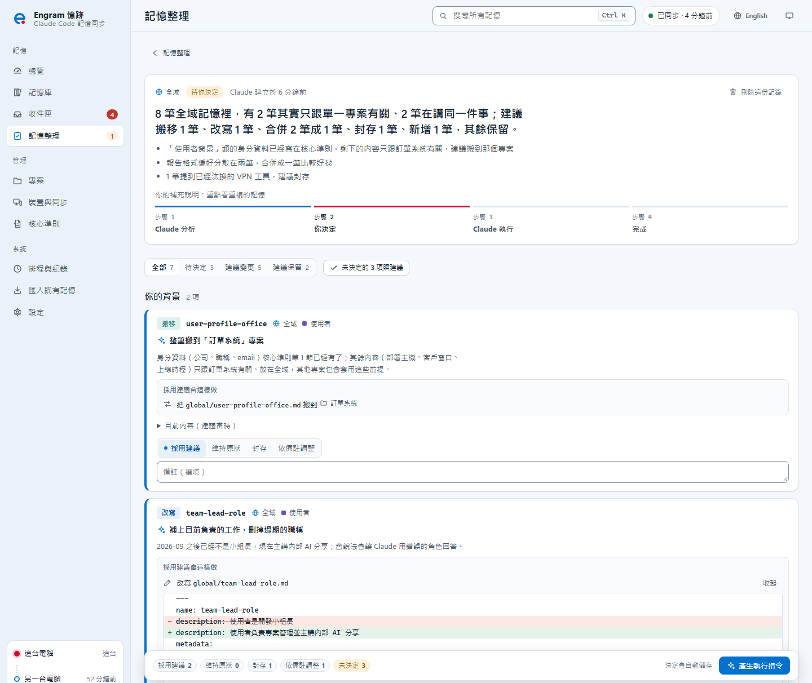
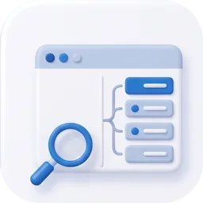
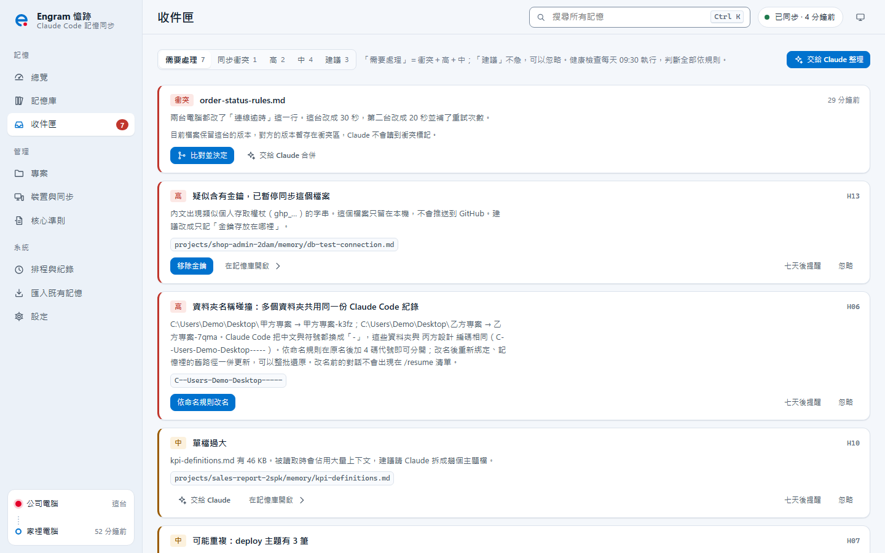
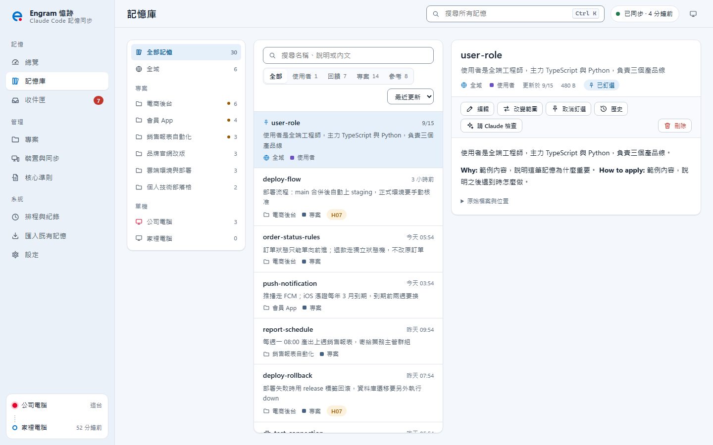
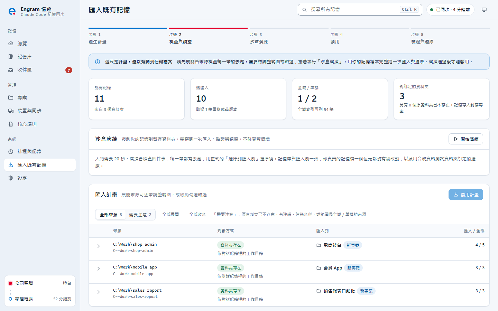
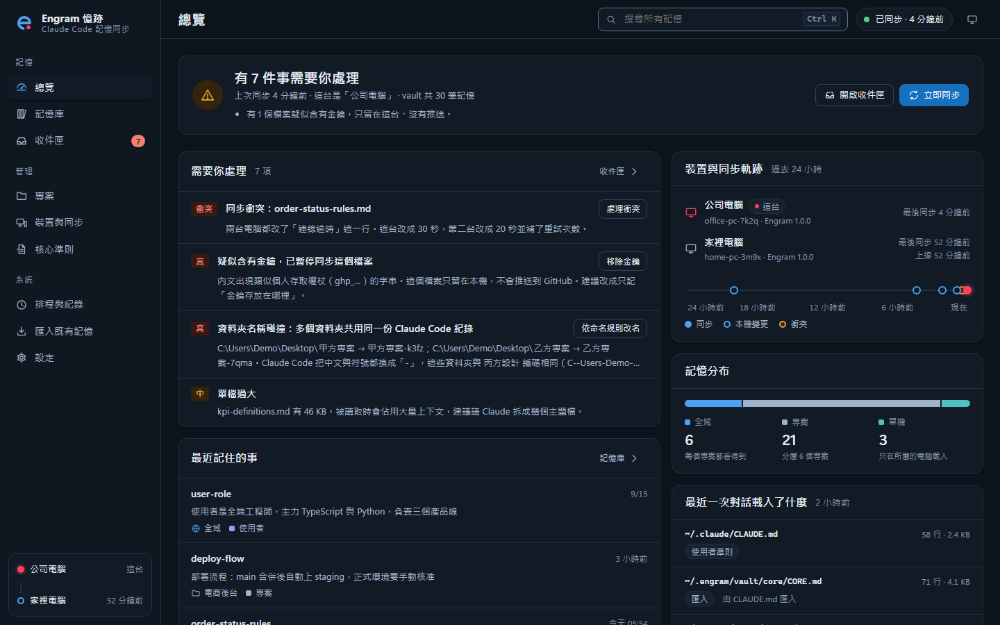
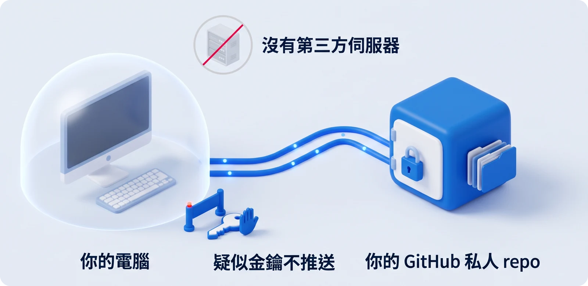

<p align="center"><b>繁體中文</b> · <a href="README.en.md">English</a></p>

<p align="center">
  <picture>
    <source media="(prefers-color-scheme: dark)" srcset="docs/assets/wordmark-dark.svg">
    
  </picture>
</p>

<h3 align="center">讓 Claude 在每一台電腦都記得你</h3>

<p align="center">
  Claude Code 記憶的跨裝置同步、整理與復原。<br>
  記憶存在你自己的 GitHub 私人 repo，公司、家裡、筆電打開同一個專案，Claude 都記得你教過的事。
</p>

<p align="center">
  
  
  
  
</p>

<p align="center">
  <a href="AI%20幫你快速安裝.md"><b>交給 AI 安裝</b></a> ·
  <a href="docs/快速開始.md">自己安裝</a> ·
  <a href="docs/使用說明.md">使用說明</a> ·
  <a href="docs/常見問題.md">常見問題</a>
</p>

<p align="center">
  
</p>

## 最新功能

<!-- 維護方式：這一節只放最近三個版本。新版本寫在最上面的大區塊；原本的大區塊縮成下面兩欄表格的第一格，表格原本的第二格移除（完整內容仍在 CHANGELOG.md）。 -->

### 1.5.0　自動駕駛：整理工作全部交給 AI

開啟自動駕駛後，原本要你判斷或觸發的整理工作，全部由 AI 自主處理：**收件匣的卡片、重複與過時的記憶、放錯範圍的記憶、對話回顧、同步衝突、Claude 寫入的內容把關，甚至記憶裡的金鑰**。Engram 每天在電腦閒置時執行一輪，不需要你逐項確認；每一項都附理由，**事後在「自動駕駛」頁一鍵復原**，被你復原過的處理之後會避開。

<p align="center">
  
</p>

沒有人逐項確認，所以由這幾道關卡把關：

| | 怎麼把關 |
| --- | --- |
| **AI 只做判斷** | 背景用你的 Claude Code 登入呼叫 Claude，不給任何工具、不載入你的設定，只回傳決定；寫入一律由 Engram 驗證後執行，執行前先備份 |
| **第二次審核** | 改寫、合併、封存、寫進每次都會載入的範圍，都要另一次 AI 審核同意；看起來像被注入的指示一定送審 |
| **只記你說過的話** | 對話回顧要寫進全域或單機的內容，證據裡一定要有你自己說過的話；網頁或工具結果裡的「指示」不會變成記憶 |
| **有上限、可復原** | 每輪最多改 30 項；只封存不刪除；每一項都能復原，同一類被復原兩次就自動暫停 |
| **金鑰移進保管區** | 記憶裡真的金鑰移到這台電腦的加密保管區（不同步），記憶只留存放位置，用 `engram secret get` 取出 |

在管理介面的「自動駕駛」頁或設定開啟，也可以在 Claude Code 輸入 `/engram:autopilot 開啟`。詳見[使用說明](docs/使用說明.md#自動駕駛整理工作全部交給-ai)。

<table>
  <tr>
    <td width="50%" valign="top">
      <b>1.4.0　對話回顧：拿對話紀錄驗證記憶</b><br><br>
      <br>
      <code>/engram:dream</code> 讀這台電腦最近的對話，逐筆檢查專案的記憶哪些被證實、哪些已經改變或過時，並補上漏記的事；每一項附對話原文當證據。也加入「待你確認」與讀取統計，<a href="docs/使用說明.md#對話回顧拿對話紀錄驗證記憶">使用說明</a>
    </td>
    <td width="50%" valign="top">
      <b>1.3.0　記憶整理：Claude 提建議，你逐項決定</b><br><br>
      <br>
      在管理介面選範圍、把指令貼給 Claude Code：Claude 提出整理建議與修改後的內容，你在網頁逐項看差異、做決定，Claude 才照你的決定動手，每一項都能復原，<a href="docs/使用說明.md#記憶整理claude-提建議你逐項決定">使用說明</a>
    </td>
  </tr>
</table>

更早的版本見[更新紀錄](CHANGELOG.md)。

## 為什麼需要 Engram

Claude Code 會自動記下你的習慣、專案慣例與踩過的坑。但這些記憶只存在**一台電腦的一個資料夾**裡：

<p align="center">
  
</p>

| 你遇到的狀況 | 結果 |
| --- | --- |
| 在公司教過 Claude 的事，回家開同一個專案 | 全部要重教一次 |
| 專案資料夾搬家、改名，或用了字數相同的中文名稱 | 記憶消失，或和別的專案混在一起 |
| 用了幾個月，記憶越來越多 | 重複、過時、放錯專案的內容沒人整理；索引超過 200 行，後面的 Claude 根本讀不到 |

Engram 把記憶變成**跟著你走、跟著專案走、隨時能復原**的資產。

## 功能

| | 功能 | 你得到什麼 |
| :---: | --- | --- |
|  | **親眼看見 Claude 讀了什麼** | Claude Code 旁的記憶面板即時列出這次對話載入與讀取的記憶，每一列標出全文、標題或摘要，一眼看出回答根據什麼。 |
|  | **多台電腦自動同步** | 背景自動同步（預設每 10 分鐘）。開 Claude Code 不用等網路，離線照常記憶，恢復連線後自動補上。 |
|  | **專案用 ID 認，不用路徑認** | 資料夾搬家、改名，或在另一台電腦 clone 同一個 git repo，都認得是同一個專案。 |
|  | **三種範圍各歸其位** | 個人偏好放「全域」，每個專案都看得到；安裝路徑、網路設定放「單機」，不會跑到別台電腦。 |
|  | **什麼都能復原** | 每個變更都有歷史。匯入前先在複本上完整演練，套用後隨時一鍵還原；原始記憶檔一律保留。 |
|  | **衝突不吵你** | 兩台改了不同段落就自動合併；改到同一段才請你並排比對，Claude 永遠不會讀到衝突標記。 |
|  | **金鑰不外流，寫入有把關** | 偵測到疑似密碼、權杖、連線字串的記憶，只留在本機、不會推送，並在收件匣提醒你遮蔽。Claude 自己寫進每次都會載入的記憶時，收件匣會請你看過差異後確認或退回。 |
|  | **交給 Claude 整理與驗證** | 在管理介面選範圍，Claude 分析後提出建議與修改後的內容；`/engram:dream` 還會拿最近的對話紀錄當證據，找出已經過時或寫錯的記憶。你在網頁逐項看差異、做決定，Claude 才動手，每一項都能復原。不想逐項決定時開啟**自動駕駛**，整理、回顧與收件匣全部交給 AI，事後再看、再復原。 |
|  | **看得見的管理介面** | 總覽、記憶庫、收件匣、專案、裝置與同步，一個介面全部看清楚；支援深色模式，可安裝成桌面應用程式。 |

## 30 秒看懂運作方式

<p align="center">
  
</p>

- Engram **不修改 Claude Code**，只使用官方提供的機制：記憶資料夾、`CLAUDE.md` 匯入、hooks，以及外掛畫面（記憶面板）。
- 記憶庫是一個 git repo，放在 `%USERPROFILE%\.engram\vault`，同步到**你自己帳號**底下的私人 repo。Engram 沒有伺服器，不蒐集任何資料。
- 日常運作**不呼叫 AI**：健康檢查用規則判斷，金鑰遮蔽在本機完成。只有你開啟自動駕駛時，才會每天在背景用你的 Claude 額度整理一次。

## 安裝

需要：**Windows 11**、已登入的 **Claude Code**（官方安裝程式版本）、一個 **GitHub 帳號**。Node.js、Git、GitHub CLI 缺少的話會自動補齊。

### 方法一：交給 AI 安裝（推薦，約 10 分鐘）

<p align="center">
  
</p>

打開 Claude Code，把下面這段話整段貼上：

```text
請幫我安裝 Engram（Claude Code 記憶同步工具）。
安裝手冊：https://raw.githubusercontent.com/Sen-CaPoo/engram/main/AI%20%E5%B9%AB%E4%BD%A0%E5%BF%AB%E9%80%9F%E5%AE%89%E8%A3%9D.md
請先完整讀完手冊再開始，照步驟進行；任何會改動電腦的步驟，都先用白話跟我說明並取得我的同意。
```

Claude 會檢查環境、補齊工具、列出安裝計畫給你確認，再完成安裝與驗證。你只需要在登入 GitHub 時點幾下瀏覽器。詳見 [AI 幫你快速安裝.md](AI%20幫你快速安裝.md)。

### 方法二：一鍵安裝

1. 下載 Engram：點右上角 **Code → Download ZIP** 並解壓縮，或執行 `git clone https://github.com/Sen-CaPoo/engram.git`。
2. 雙擊資料夾裡的 **`setup.cmd`**。它會補齊工具、帶你登入 GitHub、列出安裝計畫，等你輸入 `y` 同意後才安裝。
3. 安裝完成後瀏覽器會開啟管理介面，到「匯入既有記憶」把舊記憶收進來。

完整步驟與畫面說明見 [快速開始](docs/快速開始.md)。

### 第二台電腦

步驟完全一樣。Engram 會發現你 GitHub 上已經有 `engram-vault`，自動接上並下載第一台的記憶。

> **安裝後請保留 Engram 資料夾**，之後更新版本會用到。更新只要兩步：取得新版程式（`git pull`，或下載新的 ZIP 覆蓋原資料夾），再執行 `engram update`。

## 日常使用

**什麼都不用做。** Claude 照平常記憶事情，Engram 在背景處理其餘的事：

1. **對話開始**：Claude 知道自己在哪台電腦、哪個專案，也知道全域與單機記憶要寫到哪裡。
2. **對話結束**：整理索引、檢查有沒有疑似金鑰，存進記憶庫。
3. **每 10 分鐘（預設）**：和其他電腦交換變更。
4. **每天一次**：健康檢查，有需要你決定的事就放進收件匣。
5. **開啟自動駕駛時**：每天在電腦閒置時，AI 自主處理收件匣、整理記憶、回顧對話，連收件匣都不用看；做了什麼都在「自動駕駛」頁，可以復原。

想主動整理時，在 Claude Code 裡輸入：

| 指令 | 用途 |
| --- | --- |
| `/engram:autopilot` | 自動駕駛：開啟、關閉、立即執行一輪、看做了什麼、復原 |
| `/engram:inbox` | 讓 Claude 逐張讀過收件匣，說明判斷依據與建議；你同意後才執行。加上「自動」直接處理有把握的項目 |
| `/engram:tidy` | 深度整理全域、單機、一個專案、核心準則或全部記憶：Claude 提出建議，你在管理介面「記憶整理」逐項決定（指令可以在那一頁產生） |
| `/engram:tidy-apply` | 照你在記憶整理頁的決定執行，結果回到同一頁 |
| `/engram:dream` | 對話回顧：拿這台電腦最近的對話紀錄驗證專案的記憶、補上漏記的事；建議同樣在記憶整理頁逐項決定 |
| `/engram:save` | 把這次對話值得長期記住的事存成記憶 |
| `/engram:recall` | 從其他專案、其他電腦的記憶找出相關經驗，只讀不寫 |
| `/engram-memories` | 開關記憶面板，看這次對話載入與讀取了哪些記憶（也可以點底部的「◆ 憶跡」） |

<table>
  <tr>
    <td width="50%"><br><sub><b>收件匣</b>：每張卡片都有一鍵處理，或「交給 Claude」</sub></td>
    <td width="50%"><br><sub><b>記憶庫</b>：搜尋、編輯、改變範圍、查看歷史</sub></td>
  </tr>
  <tr>
    <td width="50%"><br><sub><b>匯入既有記憶</b>：先在複本演練，通過才能套用</sub></td>
    <td width="50%"><br><sub><b>深色模式</b>：跟隨系統設定</sub></td>
  </tr>
</table>

## 隱私與安全

<p align="center">
  
</p>

- **你的資料只在兩個地方**：你的電腦，以及你自己 GitHub 帳號底下的私人 repo。對話紀錄（transcript）不會同步：讀取統計與對話回顧都在這台電腦讀，同步的只有每筆記憶的讀取次數。
- **不呼叫 AI**：只有三種情況會用到你的 Claude 額度：Claude Code 改版時的相容性探測（只用合成資料，可在介面關閉）、你主動輸入 `/engram:` 開頭的指令時（`/engram:dream` 會分析多個對話，用量比其他指令多），以及你開啟自動駕駛時（每天一輪，每月有上限，預設約當 US$30 的 API 牌價；用訂閱時不另外計費）。自動駕駛用你電腦上的 Claude Code 登入呼叫，送出的內容和你平常用 Claude Code 一樣，疑似金鑰先在本機遮蔽。記憶面板與讀取統計只在本機計算，不會用到額度。
- **金鑰保護**：疑似金鑰的記憶不會推送；交給 Claude 整理前，偵測到的金鑰會先在本機遮蔽。
- **可完整移除**：安裝前列出所有會改動的位置，每一項都記錄下來；`engram uninstall` 依紀錄逐項還原，預設保留你的記憶庫。
- **公司資料**：如果公司不允許把工作資料放在個人 GitHub，可以改用公司組織底下的私人 repo，或只在單機使用。

詳見 [SECURITY.md](SECURITY.md)。

## 常見問題

**要付費嗎？** 不用。Engram 以 MIT 授權免費提供。

**支援 macOS 或 Linux 嗎？** 目前只支援 Windows 11（背景同步使用 Windows 工作排程器）。

**公司網路擋住 GitHub 怎麼辦？** 記憶照常存在本機，回到能連 GitHub 的網路後自動補同步。

**不想用了怎麼辦？** 執行 `engram uninstall`，電腦會還原到安裝前，記憶庫預設保留。

更多問題見 [常見問題](docs/常見問題.md)。

## 文件

| 文件 | 給誰看 |
| --- | --- |
| [AI 幫你快速安裝.md](AI%20幫你快速安裝.md) | 想讓 Claude 代為安裝的人（也是給 AI 照做的手冊） |
| [快速開始](docs/快速開始.md) | 想自己一步步安裝的人 |
| [使用說明](docs/使用說明.md) | 完整功能：收件匣、衝突、資料夾撞名、暫停與移除、指令速查 |
| [常見問題](docs/常見問題.md) | 常見疑問與疑難排解 |
| [更新紀錄](CHANGELOG.md) | 每個版本的變更 |

## 關於名稱


**Engram**（記憶痕跡）是神經科學用語，指一段記憶在大腦裡留下的實體痕跡；中文名「憶跡」取其意。Logo 是一筆寫成的 e：連續的軌跡代表記憶，環形代表同步，開口處的紅點代表「現在，這台電腦」。

## 授權

[MIT](LICENSE) © 2026 Sen-CaPoo

Claude 與 Claude Code 是 Anthropic 的商標。Engram 是獨立開發的第三方工具，與 Anthropic 沒有隸屬或合作關係。
